# MyBatisCodeAssistant User Guide

[简体中文](./user-guide_zh.md) | **English**

> An all-in-one MyBatis code helper: one-click code generation from database tables, method-name-to-SQL, smart merge, rich completion, MyBatis log analysis, and more.
> 
> We strive to minimize unnecessary configuration and embrace the principle of **convention over configuration**, making the plugin easy and pleasant to use — so you never have to struggle with excessive setup again!
> 
> We pursue the ultimate **experience**: customize generation templates to fit your needs, preview templates in real time, and generate SQL XML files for the corresponding tables dynamically from configured SQL methods across multiple tables.
> 
> This guide covers the vast majority of the plugin's features, organized as "entry point → steps → notes," with screenshots — so even first-time users can get started with ease.
> 
> Our goal: to make MyBatis development simpler, more efficient, and more intelligent.

---

## Table of Contents

- [1. Installation & Subscription](#1-installation--subscription)
- [2. Five-Minute Quick Start](#2-five-minute-quick-start)
- [3. Single-Table Code Generation](#3-single-table-code-generation)
- [4. Multi-Table Batch Generation](#4-multi-table-batch-generation)
- [5. Generate Java Class Only](#5-generate-java-class-only)
- [6. Smart Merge & Taking Over Generated Code](#6-smart-merge--taking-over-generated-code)
- [7. Method Name to SQL](#7-method-name-to-sql)
- [8. Mapper ↔ XML Navigation](#8-mapper--xml-navigation)
- [9. Inspections & Quick Fixes](#9-inspections--quick-fixes)
- [10. Smart Completion](#10-smart-completion)
- [11. Dynamic SQL Preview](#11-dynamic-sql-preview)
- [12. Interactive SQL Testing](#12-interactive-sql-testing)
- [13. String Null-Check Intention](#13-string-null-check-intention)
- [14. MyBatis Log Analyzer](#14-mybatis-log-analyzer)
- [15. SQL to MyBatis](#15-sql-to-mybatis)
- [16. Generate JOIN SQL](#16-generate-join-sql)
- [17. Generate Quick Test](#17-generate-quick-test)
- [18. Java Class to CREATE TABLE DDL](#18-java-class-to-create-table-ddl)
- [19. Database Documentation Export](#19-database-documentation-export)
- [20. Other Utilities](#20-other-utilities)
- [21. Settings Reference](#21-settings-reference)
- [22. Custom Code Templates](#22-custom-code-templates)
- [23. FAQ](#23-faq)

---

## 1. Installation & Subscription

**Install**: `Settings → Plugins → Marketplace`, search for **MyBatisCodeAssistant**, click Install and
restart the IDE.

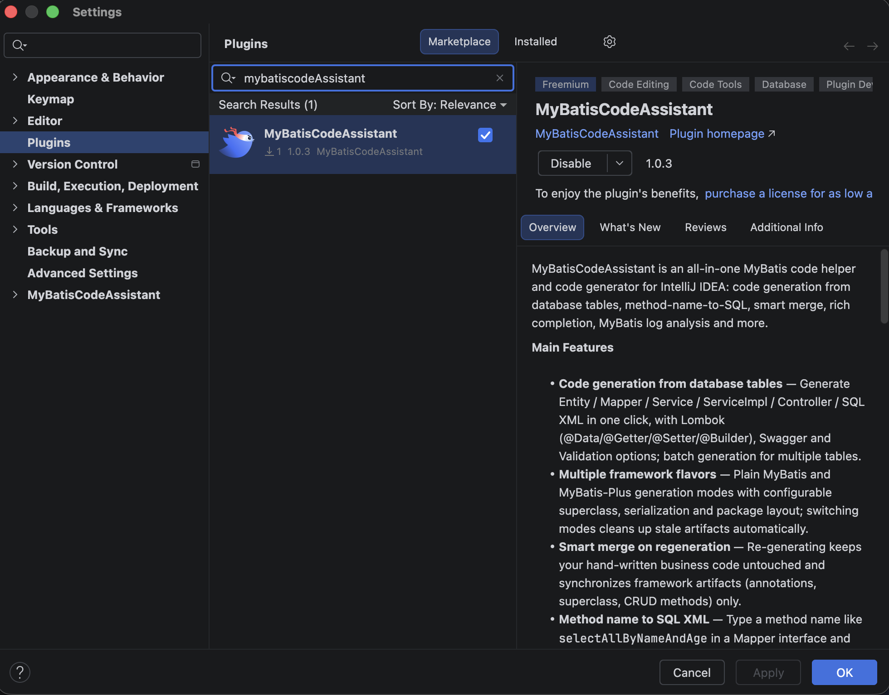

**Subscription (Freemium)**:

- The plugin is **free to install and use** for most features (navigation, completion, inspections,
  formatting, ...);
- **Code generation** and the **MyBatis Log analyzer** require a subscription; the first use shows a
  purchase / free-trial prompt;
- Subscriptions are managed by JetBrains Marketplace: `Settings → Plugins → plugin page → Manage Subscription`.

> Tip: without a subscription, paid features show a purchase hint — everything else keeps working.
> Trials can be set up in Help → Manage Subscription

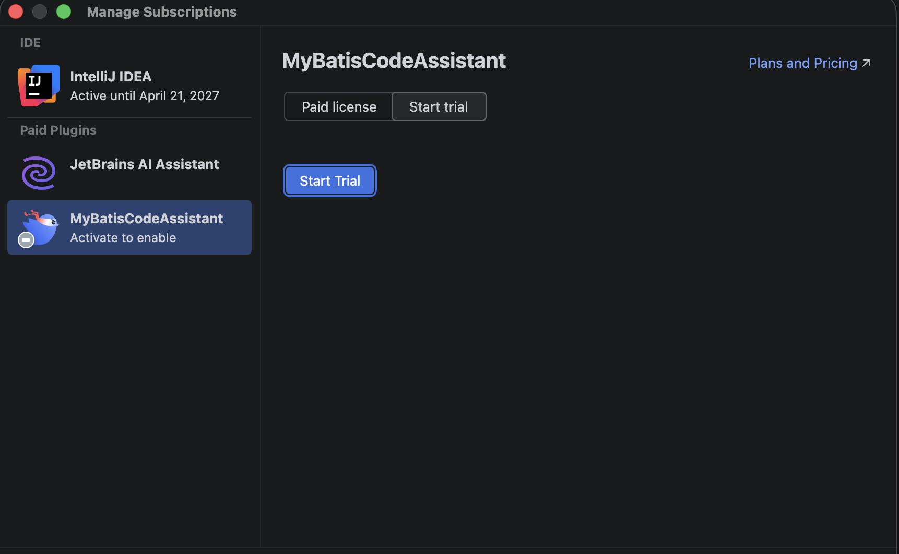
---

## 2. Five-Minute Quick Start

1. Open the **Database** tool window and configure your data source (MySQL etc.);
2. Expand the data source and **right-click any table → `Mybatis generator`**;
3. Confirm the packages, tick the options you want, click **OK**;
4. Entity, Mapper, Service, Controller and SQL XML are generated in one click;
5. Type `selectAllByXxx` in the Mapper interface and press `Alt+Enter` to generate SQL — you're done.

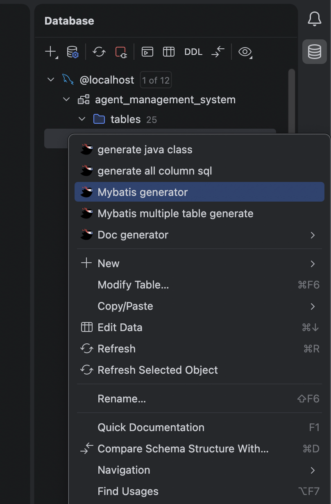

---

## 3. Single-Table Code Generation

**Entry**: Database tool window → right-click a table → **`Mybatis generator`**

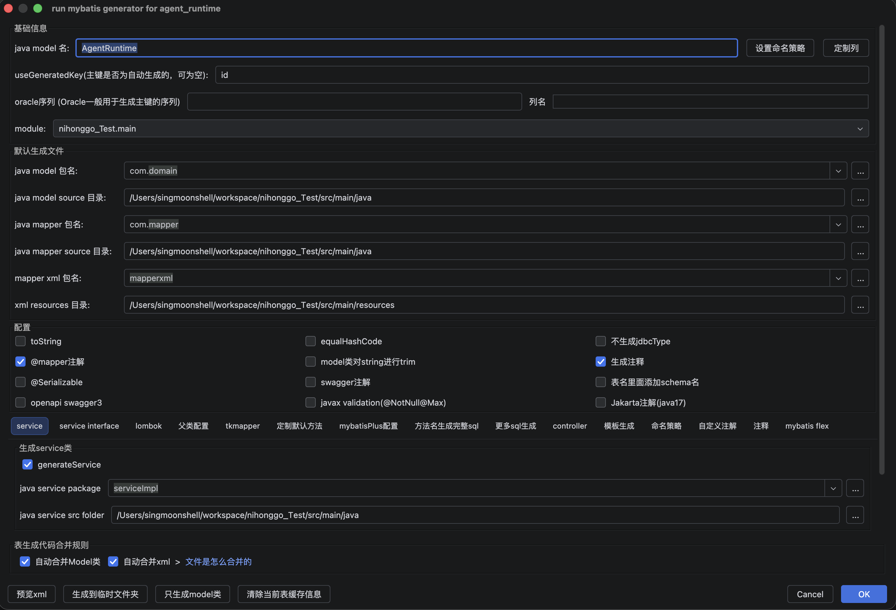

### 3.1 Basics

| Option | Description |
| --- | --- |
| Model name | Generated entity class name (camel-cased from the table name, editable) |
| Primary key / Oracle sequence | Column for useGeneratedKeys; Oracle users can configure a sequence |
| module | Target module in a multi-module project |
| Configure naming strategy (button) | Opens naming strategy settings: table prefix removal, DTO prefix, OGNL-based custom naming — see [21. Settings Reference](#21-settings-reference) |
| Custom columns (button) | Per-column overrides for the current table (Java field name / type / jdbcType) |

### 3.2 Packages & Source Roots

Configure package + source root for Model, Mapper, Mapper XML, Service, Service Interface and
Controller; previous inputs are kept as drop-down history.

### 3.3 Common Options

| Option | Description |
| --- | --- |
| Lombok @Data / @Getter@Setter / @Builder ... | Use Lombok on the entity; old getters/setters are removed automatically |
| Swagger / Validation annotations | Generate @ApiModelProperty / @NotNull etc. per field |
| comments | Copy database column comments onto Java fields |
| Trim string | Setters trim String values (mutually exclusive with Lombok accessors) |
| Serializable / toString / equals / hashCode | Generate on demand |
| Generation mode | Plain MyBatis / MyBatis-Plus; switching cleans up the previous mode's annotations and supertypes |
| actual column name | Use raw column names without camel-case conversion |

### 3.4 Bottom Toolbar

- **Save configuration / Export JSON / Import JSON** — reuse configurations across projects;
- **Generate to temp folder** — write output to any folder first, inspect, then generate for real;
- **Template preview / Preview XML** — see the code before generating;
- **Merge rules bar** — `auto merge model` / `auto merge xml` toggles plus the
  "**How files are merged**" link (opens the detailed merge explanation, see section 6).

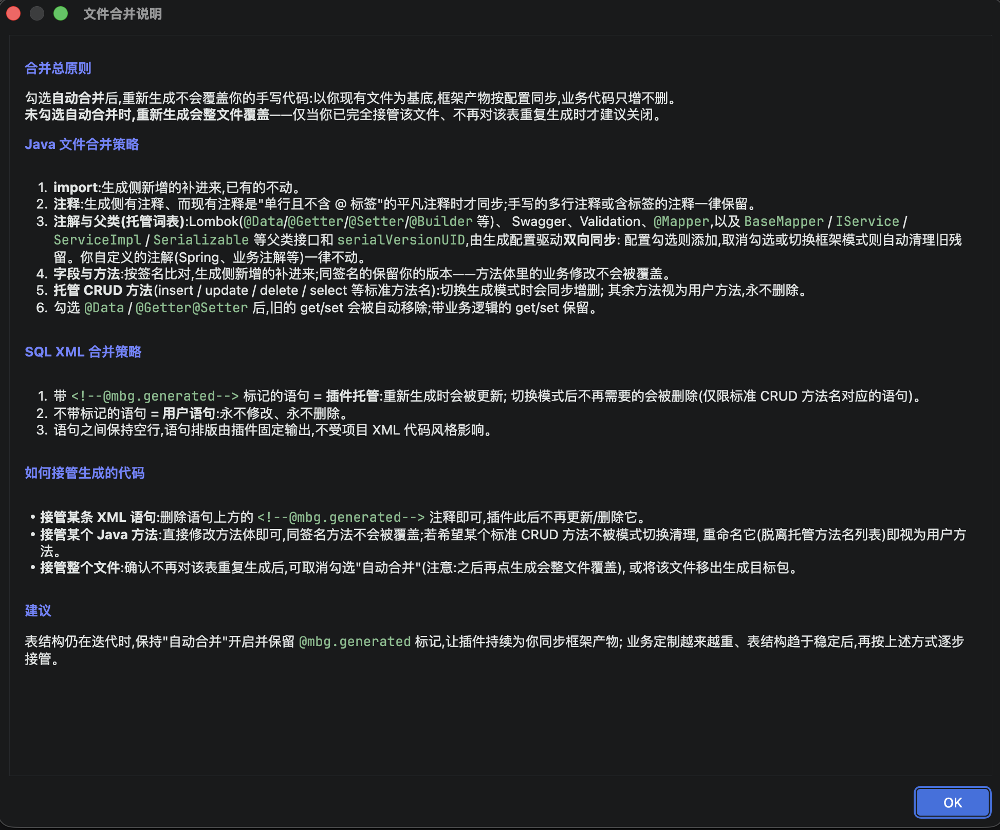

---

## 4. Multi-Table Batch Generation

**Entry**: Database tool window → select multiple tables (or right-click) → **`Mybatis multiple table generate`**

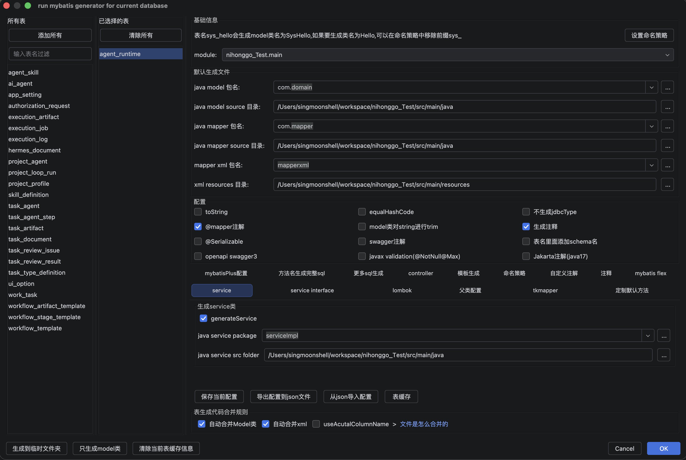

1. Tick the tables on the left ("Add all" supported);
2. Remaining options are the same as the single-table dialog and apply to every selected table;
3. Click OK — tables are generated one by one, and a summary dialog reports success/failure counts.

> Batch generation follows the same smart-merge rules — existing hand-written code is never overwritten.

---

## 5. Generate Java Class Only

**Entry**: Database tool window → right-click a table → **`generate java class`**

Use this when you only need a Java class for a table (no Mapper/XML). The dialog lets you set the class
name, package and column-name mode; existing classes are skipped with a notice.

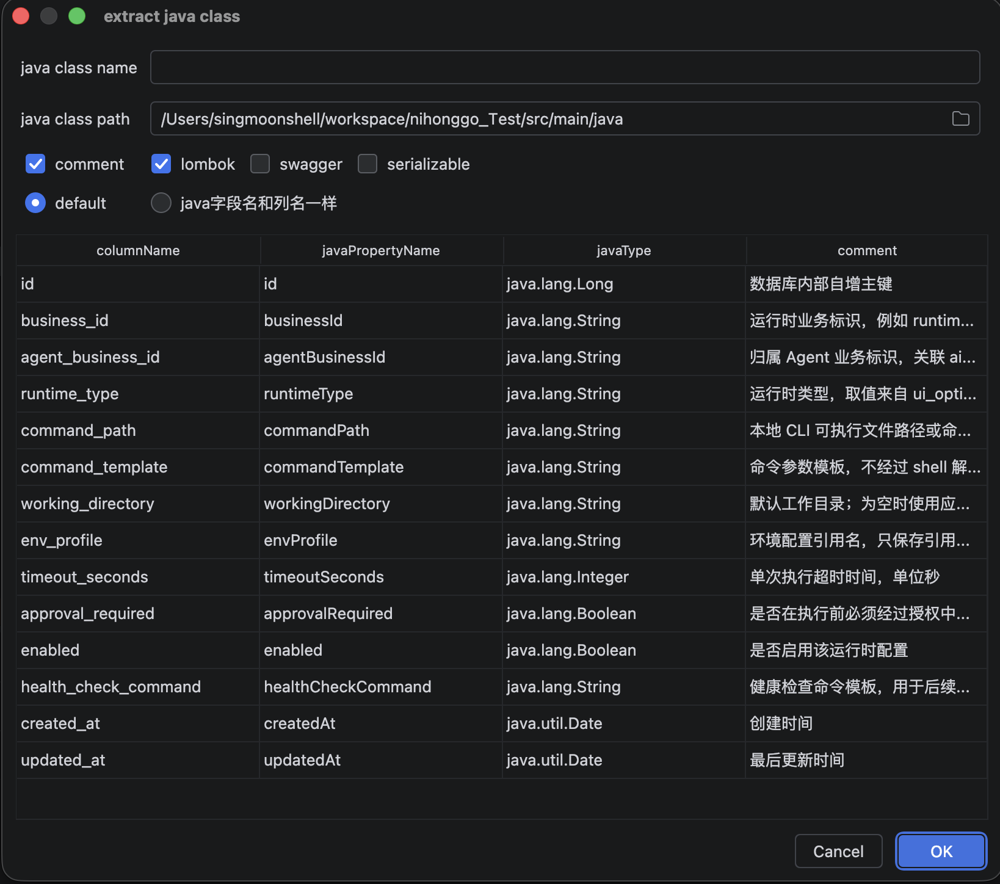

---

## 6. Smart Merge & Taking Over Generated Code

The key difference from "overwrite-the-file" generators: **re-generating never overwrites your
hand-written code**.

Click "**How files are merged**" at the bottom of the generation dialogs for the full rules. Highlights:

- **Java files**: imports are only added; methods with identical signatures keep YOUR version;
  Lombok/Swagger/Validation annotations, supertypes and serialVersionUID (the "managed vocabulary")
  are synchronized both ways according to your options; your own annotations and methods are never deleted;
- **SQL XML**: statements marked `<!--@mbg.generated-->` are plugin-managed (updated / cleaned up);
  unmarked statements are never touched;
- **Taking over**:
  - an XML statement → delete its `@mbg.generated` comment;
  - a Java method → just edit the body (identical signatures are never overwritten);
  - a whole file → uncheck "auto merge" (careful: generating afterwards overwrites the whole file).

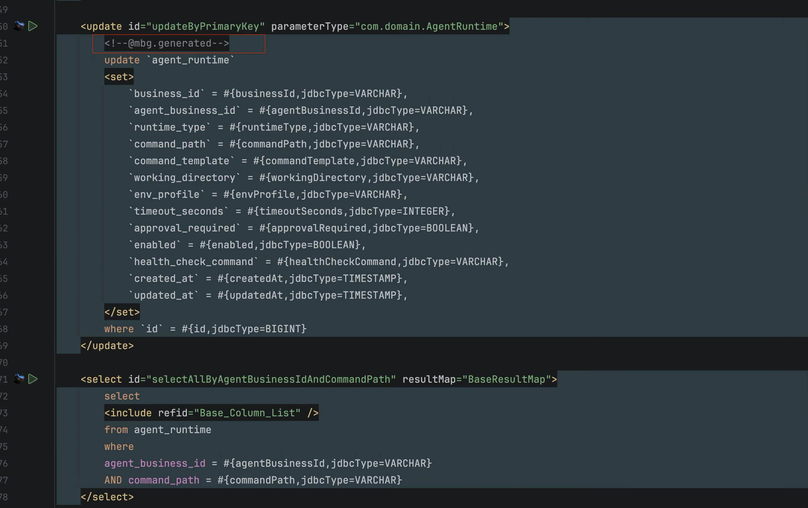

---

## 7. Method Name to SQL

**Entry**: type a method name in a Mapper interface → caret on the name → **`Alt+Enter`**

Available intentions:

| Intention | Purpose |
| --- | --- |
| Generate MyBatis SQL (SmartJpa) | Generate the XML statement + complete the interface method |
| Generate MyBatis SQL (Advance) | Advanced dialog: return type, if-test conditions, default date fields |
| Generate annotation SQL | Generate @Select/@Insert annotation SQL (script style) |
| Generate QueryWrapper | Generate MyBatis-Plus QueryWrapper code |
| Generate QueryWrapper with if-test | QueryWrapper with null-guards |

**Method name grammar examples**:

```
selectAllByAgentBusinessId              → SELECT ... WHERE agent_business_id = ?
selectOneByIdAndStatus                  → two conditions
countByNameLike                         → COUNT + LIKE
updateStatusByIdIn                      → batch update a column by ID collection
deleteByCreatedAtBefore                 → range delete by time
insertSelective / insertBatch           → selective / batch insert
```

Segment-by-segment completion (By/And/OrderBy/Like/In...) assists while typing.

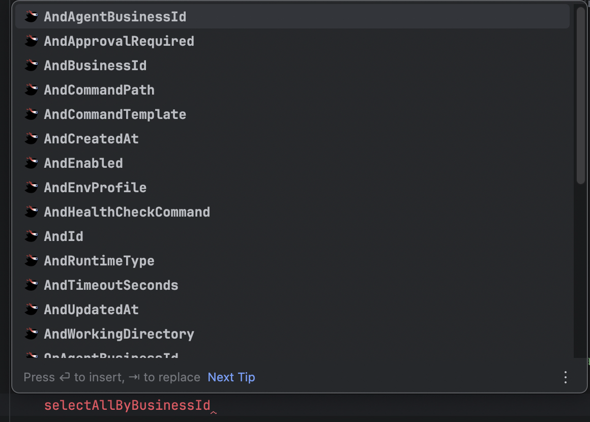


Generated statements carry the `<!--@mbg.generated-->` marker and a fixed layout (blank line between
statements, single-line include) that is independent of your project XML code style.

---

## 8. Mapper ↔ XML Navigation

- A **bird icon** next to each Mapper method jumps to the XML statement;
- The XML statement has the same marker to jump back;
- Mapper interfaces/XML files get dedicated file icons;
- In Spring projects, injected mapper fields (`@Autowired`/`@Resource`) navigate to the mapper too.

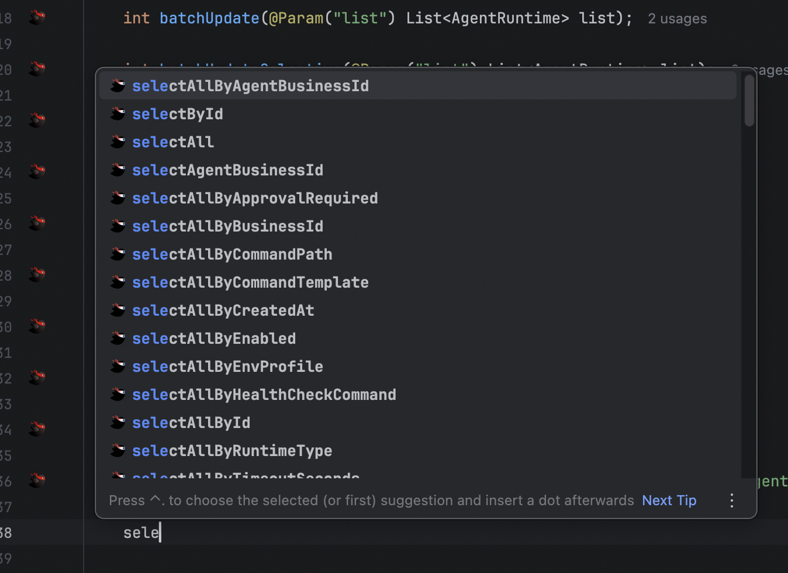

---

## 9. Inspections & Quick Fixes

Mapper files are checked automatically; fix everything with `Alt+Enter`:

| Inspection | Quick fix |
| --- | --- |
| Interface method without an XML statement (red) | Create the statement block in XML |
| XML statement not referenced by any method | Delete the unused statement |
| Wrong / missing / duplicated resultMap property or column | Add missing mappings, remove duplicates |
| Missing @Param annotations | Add @Param to all parameters |
| Misspelled tags/attributes | Suggest the correct candidates |

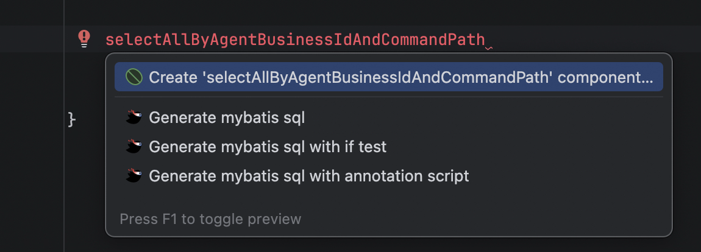

---

## 10. Smart Completion

### 10.1 Table / Column Completion (inside SQL XML)

- **Stage 1**: type a table fragment (e.g. `good`) → tables from your data sources (with schema) plus
  columns from the statement context;
- **Stage 2**: type `alias.` or `table.` (e.g. `g.`) → all columns of that table with types;
- **Fuzzy matching** (typing `gn` matches `goods_name`);
- Without a data source, falls back to columns derived from entity fields.

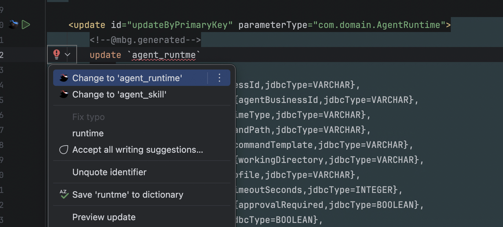
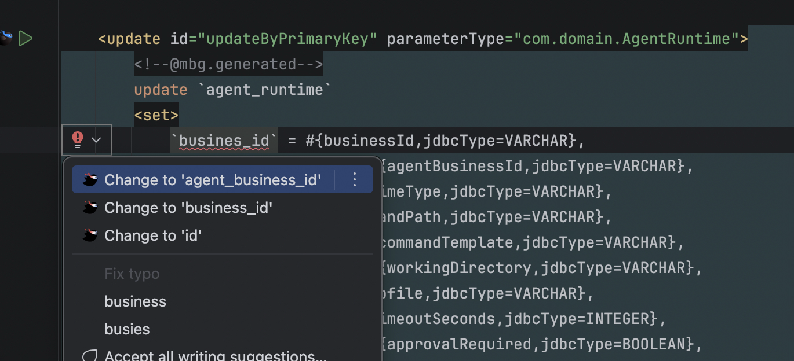

### 10.2 `#{}` Parameter Completion

- `#{` suggests method parameters and entity fields (with `,jdbcType=XXX` variants);
- `,` suggests all parameter attributes: `jdbcType` / `javaType` / `typeHandler` / `mode` /
  `numericScale` / `resultMap` / `jdbcTypeName` — attributes already present are filtered out;
- `jdbcType=` lists all JDBC types; `javaType=` lists MyBatis type aliases and common class names.

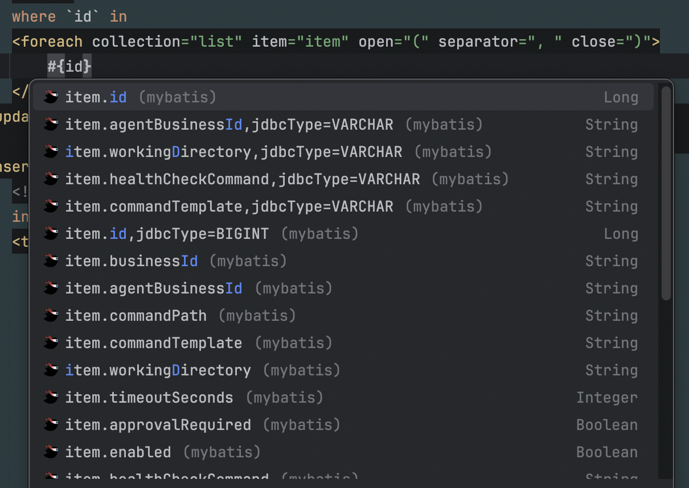

### 10.3 OGNL Completion

Inside `if test=""`, `when test=""`, `foreach collection=""` and `bind value=""`: method parameters,
entity field paths and `!= null and != ''` snippets.

### 10.4 More

`<include refid="">` suggests SQL fragments from the current and other mappers; resultMap
`property`/`column` and statement `resultMap`/`parameterType` attribute values complete as well.

---

## 11. Dynamic SQL Preview

**Entry**: right-click inside an XML statement → **`Preview Dynamic MyBatis SQL`**

Expands `include / where / set / trim / foreach / if` and renders the final SQL read-only — a quick way
to verify dynamic assembly.

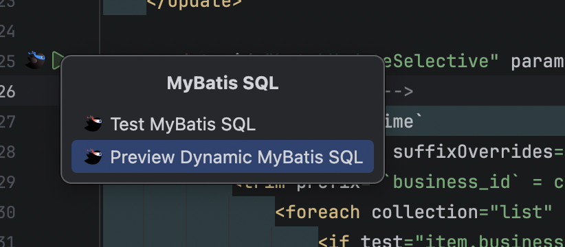
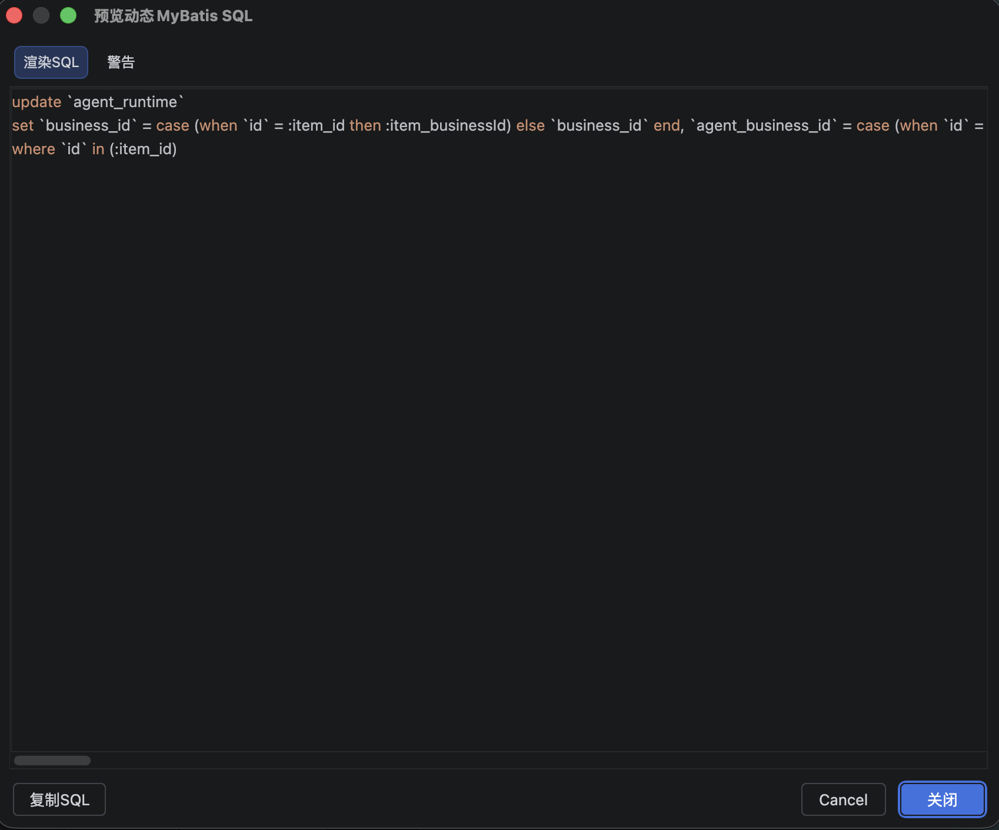

---

## 12. Interactive SQL Testing

**Entry**: right-click inside an XML statement → **`Test MyBatis SQL`**

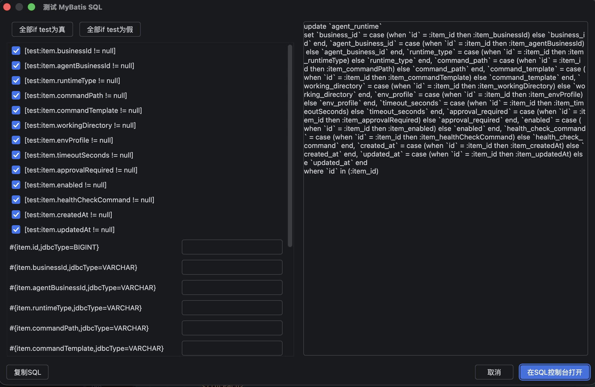

1. All `if/when` conditions are listed as checkboxes — toggling re-renders instantly
   ("all true / all false" buttons included);
2. One input per `#{}`/`${}` parameter — values are substituted live (numbers unquoted, strings quoted
   and escaped);
3. The final executable SQL renders on the right; **Copy SQL** with one click;
4. **Open sql in file** writes the SQL into a scratch file so you can run it in the IDE database console.

---

## 13. String Null-Check Intention

**Entry**: caret inside an XML statement → `Alt+Enter` →
**`Make all string compare to null change to null and empty in current sql`**

Rewrites every `x != null` on **String fields** into `x != null and x != ''` in the current statement.
Non-String fields and conditions that already check emptiness are skipped; running it twice changes nothing.

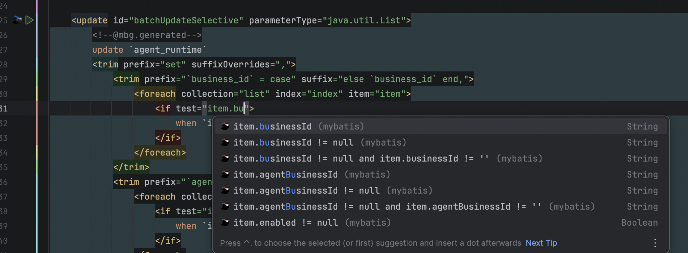

---

## 14. MyBatis Log Analyzer

**Entry**: the **`MyBatis Log`** tool window (or `Tools → Parse MyBatis Log`)

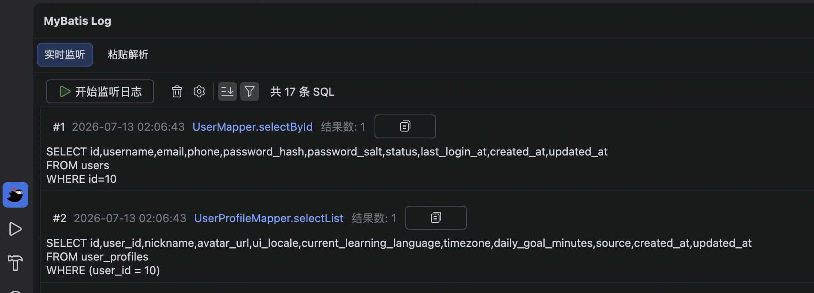

### 14.1 Live Listening

1. Click **Start listening** in the tool window;
2. Run your application — `Preparing:` / `Parameters:` console lines are captured in real time and
   restored into **executable SQL with parameters substituted**;
3. Each SQL shows its source mapper method — **click to navigate**;
4. "Listen automatically on project startup" is available in the settings.

### 14.2 Paste to Parse

Switch to the **Paste** tab, paste MyBatis logs from anywhere (test environments, files) and parse them
into executable SQL.

### 14.3 Convert a Selection

Select Preparing/Parameters lines in any editor/console → right-click → **`MyBatis Log To SQL`**.

### 14.4 Settings

The tool window settings cover: auto-listen on startup, log encoding (UTF-8/GBK and 6 more),
parsing prefixes, etc.

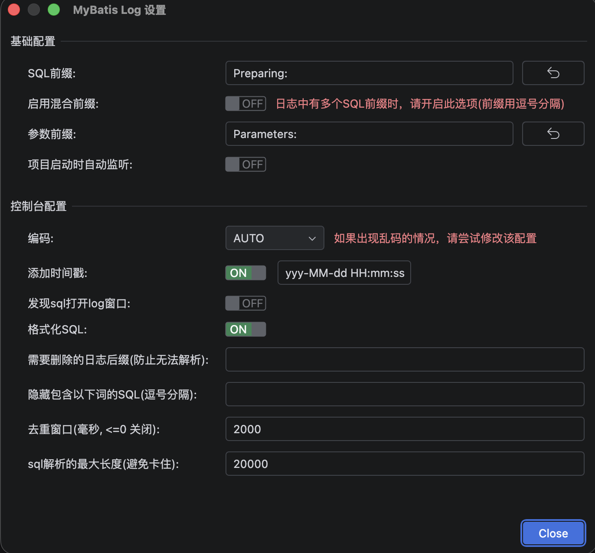

---

## 15. SQL to MyBatis

**Entry**: select an SQL statement in the editor → right-click → **`SQL To MyBatis Statement`**

Converts a ready-made SQL statement into a mapper XML statement plus the Java interface method;
`?` placeholders become `#{param}`.

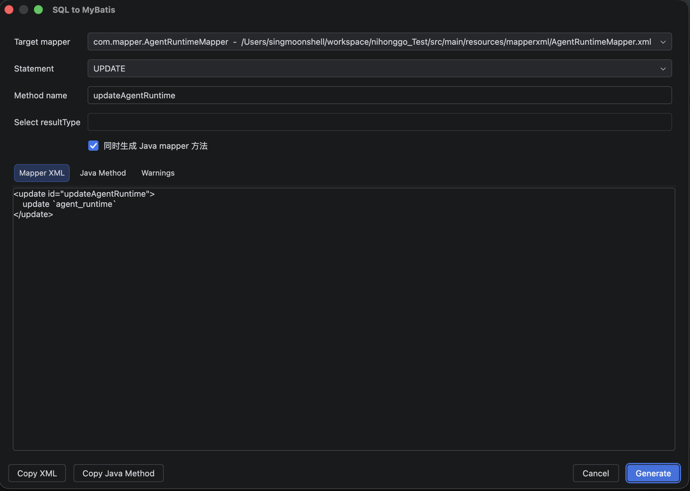

---

## 16. Generate JOIN SQL

**Entry**: right-click inside a mapper XML or interface → **`Generate Join SQL`**

Pick the main table, joined tables and join conditions in the dialog — an aliased JOIN query and its
resultMap are generated.

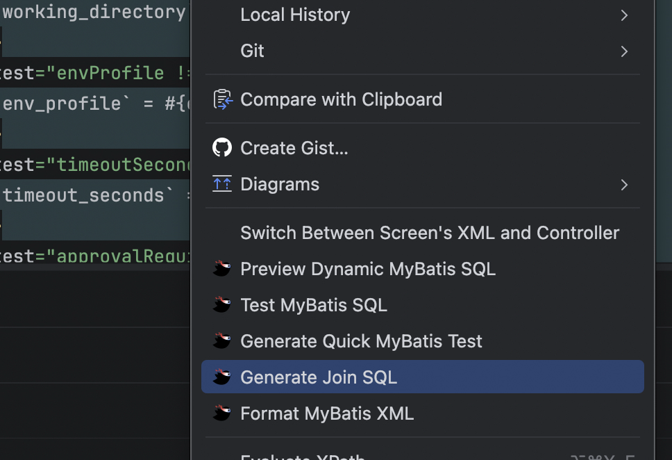

---

## 17. Generate Quick Test

**Entry**: right-click inside a Mapper interface → **`Generate Quick MyBatis Test`**

Generates a JUnit test class skeleton (with Spring context wiring) for the selected mapper method.

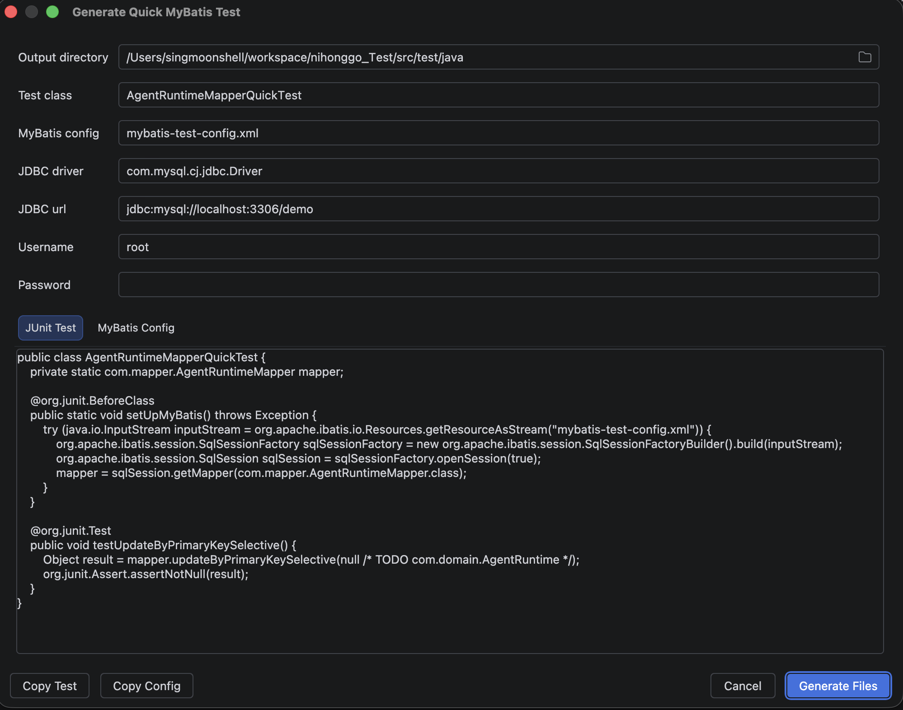

---

## 18. Java Class to CREATE TABLE DDL

**Entry**: right-click inside an entity class → **`Generate Create Table SQL`**

Derives column types from field types and produces a `CREATE TABLE` statement — copy it or write it to
an SQL file.

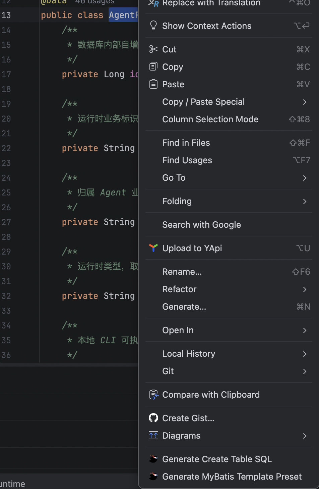
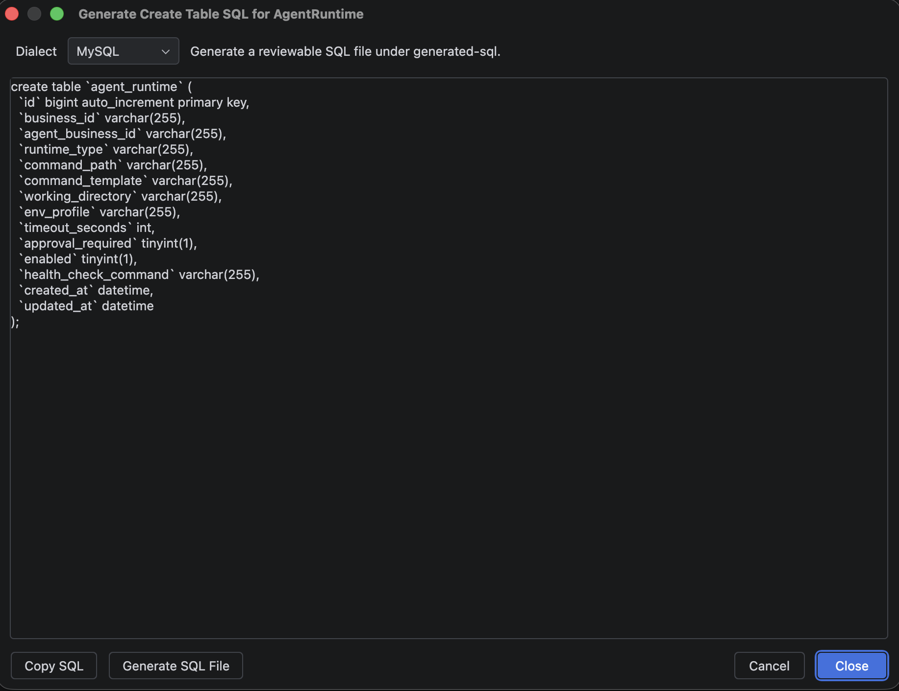

---

## 19. Database Documentation Export

**Entry**: Database tool window → right-click a data source/table → **`Doc generator`** → pick a format

| Format | Description |
| --- | --- |
| Doc (.doc) | Word document listing every table's columns, types and comments |
| Excel (.xlsx) | Spreadsheet-style structure documentation |
| Markdown (.md) | Markdown suitable for a project wiki |

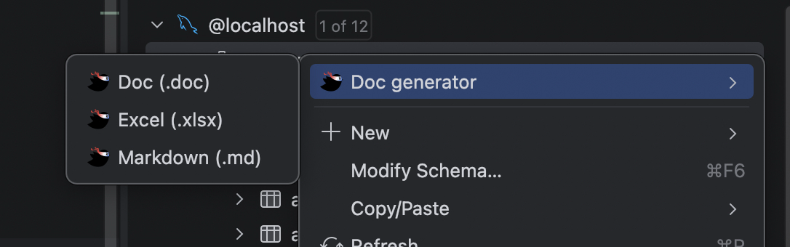

---

## 20. Other Utilities

| Feature | Entry | Description |
| --- | --- | --- |
| All-column SQL fragment | Database right-click → `generate all column sql` | `col1, col2, ...` list ready to paste |
| XML formatting | right-click in mapper XML → `Format MyBatis XML` | Reformat the whole mapper file MyBatis-style |
| Template presets | right-click → `Generate MyBatis Template Preset` | Insert common statement templates (CDATA, collection, ...) |

---

## 21. Settings Reference

**Entry**: `Settings → MyBatisCodeAssistant`

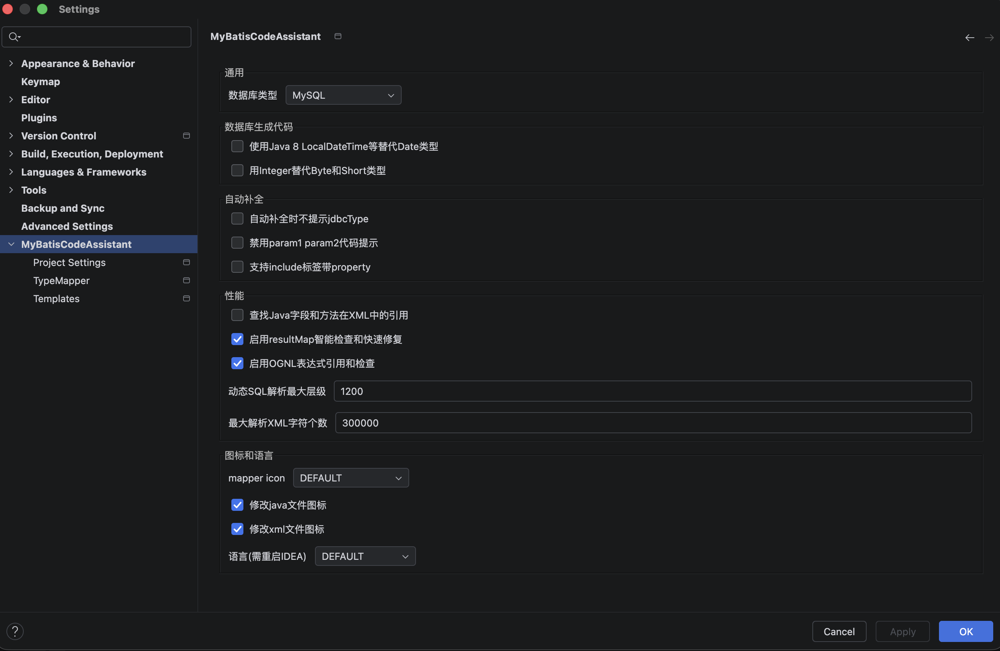

| Page | Contents |
| --- | --- |
| Main settings | Annotation SQL support, "no jdbcType in completion", dynamic SQL render depth and other global switches |
| Project Settings | Naming strategies (table prefix removal, DTO prefix, OGNL-based custom naming; multiple strategies supported) |
| TypeMapper | Database type ↔ Java type mapping table, fully editable (e.g. tinyint(1) → Boolean) |
| Templates | Generation template management: view, edit, restore defaults |

---

## 22. Custom Code Templates

**Entry**: `Settings → MyBatisCodeAssistant → Templates`, or "Template preview" in the generation dialog

- Templates use **Velocity 2.x** syntax (`$foreach.count`, `#if`, `#foreach`, ...);
- Available variables: `$table` (table info), `$config` (generation options), `$tool` (helpers) —
  documented inside the editor;
- Changes can be **previewed** instantly; one click restores the default template.

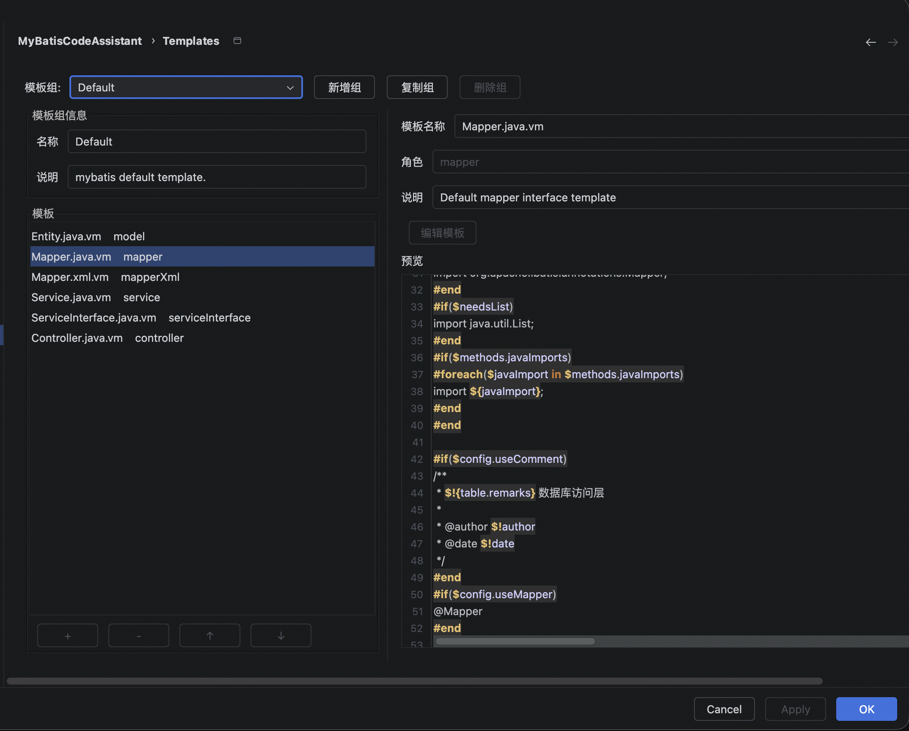
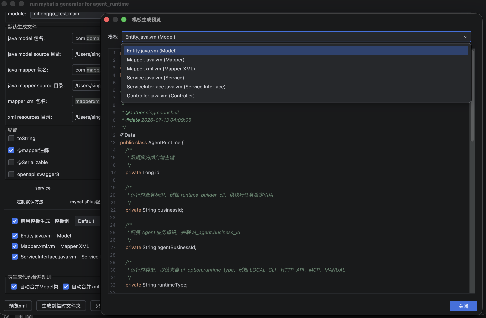

---

## 23. FAQ

**Q: Will re-generating overwrite my business code?**
No. With "auto merge" on (the default), hand-written code is only ever added to — see section 6.
Only with auto merge off does generation overwrite the whole file.

**Q: Generation fails with "IndexNotReadyException"?**
The IDE is still indexing — wait for the progress bar to finish and retry.

**Q: The IDE reports SQL errors (e.g. Dataflow interpretation error) in my mapper XML?**
That is a false positive of the IDE's built-in SQL inspection on dynamic SQL — harmless. You can disable
`Settings → Editor → Inspections → SQL → Constant expression`.

**Q: MyBatis Log captures nothing?**
Make sure MyBatis logging is at DEBUG level (you can see `Preparing:` lines in the console). For garbled
Chinese characters, switch the encoding in the Log settings.

**Q: How do I stop the plugin from updating one generated XML statement?**
Delete the `<!--@mbg.generated-->` comment above it — the statement is yours from then on.

**Q: Where do I manage my subscription?**
`Settings → Plugins → MyBatisCodeAssistant → Manage Subscription` — handled by JetBrains Marketplace,
free trial available.

---

*This guide matches plugin version 1.0.0. Screenshots live in `docs/images/guide/`; see
`docs/images/guide/README.md` for the capture checklist.*

- 📖 QQ group1：476672294
- 📖 QQ group2：872237547
- 📖 LINE：singmoonshell