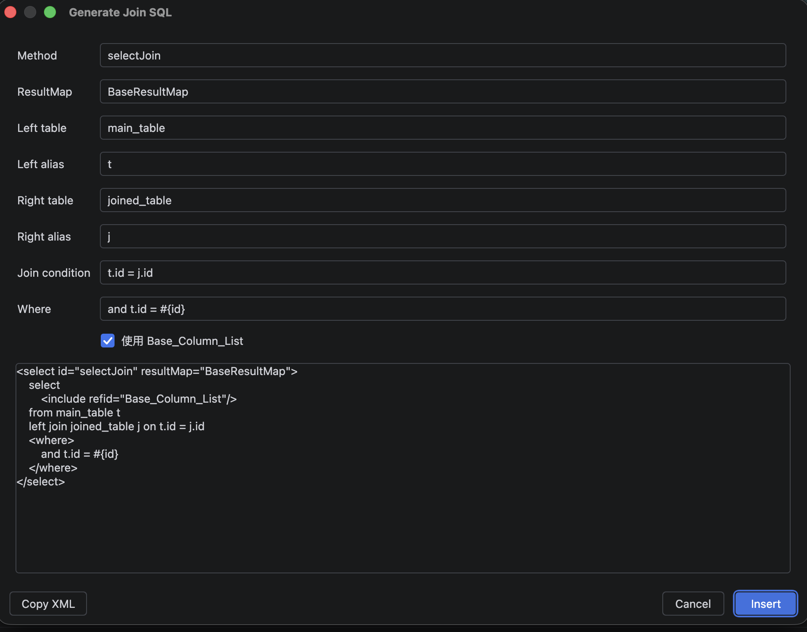

# MyBatisCodeAssistant 使用说明

**简体中文** | [English](./user-guide_en.md)

> 一款 MyBatis 全家桶代码助手:数据库表一键生成代码、方法名生成 SQL、智能合并、智能补全、MyBatis 日志解析等。
> 本文覆盖插件全部功能,按"入口 → 操作步骤 → 注意事项"组织,配合截图,零基础也能上手。

---

## 目录

- [1. 安装与订阅](#1-安装与订阅)
- [2. 五分钟快速上手](#2-五分钟快速上手)
- [3. 单表生成代码](#3-单表生成代码)
- [4. 多表批量生成](#4-多表批量生成)
- [5. 仅生成 Java 实体类](#5-仅生成-java-实体类)
- [6. 智能合并与接管生成代码](#6-智能合并与接管生成代码)
- [7. 方法名生成 SQL](#7-方法名生成-sql)
- [8. Mapper 与 XML 互相跳转](#8-mapper-与-xml-互相跳转)
- [9. 检查与快速修复](#9-检查与快速修复)
- [10. 智能补全](#10-智能补全)
- [11. 动态 SQL 预览](#11-动态-sql-预览)
- [12. 交互式 SQL 测试](#12-交互式-sql-测试)
- [13. String 判空意图](#13-string-判空意图)
- [14. MyBatis Log 日志解析](#14-mybatis-log-日志解析)
- [15. SQL 转 MyBatis](#15-sql-转-mybatis)
- [16. 生成 JOIN 语句](#16-生成-join-语句)
- [17. 生成快速测试用例](#17-生成快速测试用例)
- [18. Java 类生成建表 DDL](#18-java-类生成建表-ddl)
- [19. 数据库文档导出](#19-数据库文档导出)
- [20. 其他实用工具](#20-其他实用工具)
- [21. 设置页详解](#21-设置页详解)
- [22. 自定义代码模板](#22-自定义代码模板)
- [23. 常见问题 FAQ](#23-常见问题-faq)

---

## 1. 安装与订阅

**安装**:`Settings → Plugins → Marketplace`,搜索 **MyBatisCodeAssistant**,点击 Install 后重启 IDE。


**订阅说明(Freemium 部分收费)**:

- 插件**免费安装、免费使用**大部分功能(跳转、补全、检查、格式化等);
- **代码生成**与 **MyBatis Log** 等高级功能需要订阅,首次使用会弹出购买/试用引导,支持免费试用;
- 订阅由 JetBrains Marketplace 官方托管,在 IDE 的 `Settings → Plugins → 插件页 → Manage Subscription` 管理。

> 提示:未订阅时点击付费功能会出现引导气泡,不影响其余功能使用。

---

## 2. 五分钟快速上手

1. 在 IDE 右侧打开 **Database** 工具窗口,配置好你的数据源(MySQL 等);
2. 展开数据源,**右键任意一张表 → `Mybatis generator`**;
3. 在弹窗中确认包路径、勾选需要的选项,点击 **OK**;
4. Entity、Mapper、Service、Controller、SQL XML 一键生成完毕;
5. 在 Mapper 接口里输入 `selectAllByXxx` 方法名,`Alt+Enter` 生成 SQL —— 上手完成。


---

## 3. 单表生成代码

**入口**:Database 工具窗口 → 右键数据表 → **`Mybatis generator`**


### 3.1 基础区

| 配置项 | 说明 |
| --- | --- |
| Model name | 生成的实体类名(默认按表名驼峰转换,可改) |
| 主键 / Oracle sequence | 指定 useGeneratedKeys 的主键列;Oracle 用户可配置序列 |
| module | 生成到哪个模块(多模块工程) |
| 设置命名策略(按钮) | 打开命名策略设置:表前缀去除、DTO 前缀、OGNL 自定义命名等,见 [21. 设置页详解](#21-设置页详解) |
| 自定义列(按钮) | 对当前表逐列调整 Java 字段名/类型/jdbcType |

### 3.2 包路径与源目录

分别为 Model、Mapper、Mapper XML、Service、Service Interface、Controller 配置包路径与源目录;历史输入会保存为下拉候选。

### 3.3 常用选项

| 选项 | 说明 |
| --- | --- |
| Lombok @Data / @Getter@Setter / @Builder 等 | 实体类使用 Lombok 注解,勾选后会自动删除旧的 get/set 方法 |
| Swagger / Validation 注解 | 为字段生成 @ApiModelProperty / @NotNull 等 |
| comments | 把数据库字段注释同步为 Java 字段注释 |
| Trim string | String 字段 setter 自动 trim(与 Lombok 注解互斥) |
| Serializable / toString / equals / hashCode | 按需生成 |
| 生成模式 | 普通 MyBatis / MyBatis-Plus,切换后旧模式的注解与父类会被自动清理 |
| actual column name | 使用数据库原始列名(不做驼峰转换) |

### 3.4 底部工具条

- **保存当前配置 / 导出 JSON / 导入 JSON**:配置可跨项目复用;
- **生成到临时目录**:先输出到任意文件夹,确认无误再正式生成;
- **模板预览 / 预览 XML**:生成前查看即将产出的代码;
- **合并规则区**:`自动合并 Model` / `自动合并 XML` 两个开关 + "**文件是怎么合并的**"链接(点击弹出详细合并说明,见第 6 节)。


---

## 4. 多表批量生成

**入口**:Database 工具窗口 → 选中多张表(或右键任意表)→ **`Mybatis multiple table generate`**


1. 左侧表列表勾选要生成的表(支持"Add all");
2. 其余配置与单表弹窗一致,统一应用到所有勾选的表;
3. 点击 OK 后逐表生成,完成后弹窗提示成功/失败数量。

> 提示:批量生成同样遵守智能合并规则,已有手写代码不会被覆盖。

---

## 5. 仅生成 Java 实体类

**入口**:Database 工具窗口 → 右键数据表 → **`generate java class`**

只想要一个与表对应的 Java 类(不生成 Mapper/XML)时使用。弹窗中可配置类名、包路径、是否使用原始列名;若类已存在会跳过并提示。


---

## 6. 智能合并与接管生成代码

这是本插件与"整文件覆盖式"生成器最大的区别:**重新生成不会覆盖你的手写代码**。

完整规则点击生成弹窗底部的"**文件是怎么合并的**"查看,核心要点:

- **Java 文件**:import 只增;同签名方法保留你的版本;Lombok/Swagger/Validation 注解、父类接口、serialVersionUID 等"托管词表"按配置双向同步;你自定义的注解和方法永不删除;
- **SQL XML**:带 `<!--@mbg.generated-->` 标记的语句由插件托管(会更新/清理),不带标记的语句永不改动;
- **接管方式**:
  - 接管一条 XML 语句 → 删除它上方的 `@mbg.generated` 注释;
  - 接管一个 Java 方法 → 直接改方法体即可(同签名不覆盖);
  - 接管整个文件 → 取消勾选"自动合并"(注意:之后再生成会整文件覆盖)。


---

## 7. 方法名生成 SQL

**入口**:在 Mapper 接口中输入方法名 → 光标停在方法名上 → **`Alt+Enter`**

支持的意图(Intention):

| 意图 | 用途 |
| --- | --- |
| Generate MyBatis SQL(SmartJpa) | 按方法名生成 XML 语句 + 补全接口方法签名 |
| Generate MyBatis SQL(Advance) | 高级模式:弹窗中可选返回类型、if-test 条件、默认日期字段等 |
| Generate annotation SQL | 生成 @Select/@Insert 等注解 SQL(脚本形式) |
| Generate QueryWrapper | 生成 MyBatis-Plus QueryWrapper 调用代码 |
| Generate QueryWrapper with if-test | 带非空判断的 QueryWrapper |

**方法名语法示例**:

```
selectAllByAgentBusinessId              → SELECT ... WHERE agent_business_id = ?
selectOneByIdAndStatus                  → 双条件查询
countByNameLike                         → COUNT + LIKE
updateStatusByIdIn                      → 按 ID 集合批量更新指定字段
deleteByCreatedAtBefore                 → 时间范围删除
insertSelective / insertBatch           → 选择性插入 / 批量插入
```

输入过程中有**方法名分段补全**提示(By/And/OrderBy/Like/In...)。


生成的 XML 语句自动带 `<!--@mbg.generated-->` 标记、固定排版(语句间空行、include 单行),不受项目 XML 代码风格影响。

---

## 8. Mapper 与 XML 互相跳转

- Mapper 接口方法左侧出现**小鸟图标**,点击跳转到对应 XML 语句;
- XML 语句左侧同样有图标,点击跳回接口方法;
- 接口/XML 文件图标替换为专属图标,一眼区分 Mapper 文件;
- Spring 环境下,`@Autowired`/`@Resource` 注入的 Mapper 字段可直接跳转到实现。


---

## 9. 检查与快速修复

打开 mapper 文件即自动检查,`Alt+Enter` 一键修复:

| 检查 | 修复动作 |
| --- | --- |
| 接口方法没有对应 XML 语句(报红) | 一键在 XML 中创建语句块 |
| XML 语句没有被任何接口方法引用 | 一键删除无用语句 |
| resultMap 的 property 拼写错误 / 缺失字段 / 重复 property/column | 一键补齐缺失映射、删除重复项 |
| 方法参数缺少 @Param 注解 | 一键为所有参数添加 @Param |
| 标签/属性拼写错误 | 提示并给出正确候选 |


---

## 10. 智能补全

### 10.1 表名 / 列名补全(SQL XML 内)

在语句标签内直接书写 SQL 时:

- **阶段一**:输入表名片段(如 `good`)→ 提示数据源中的表(带 schema)和当前语句上下文的列;
- **阶段二**:输入 `别名.` 或 `表名.`(如 `g.`)→ 提示该表的所有列(带类型);
- 支持**模糊匹配**(输入 `gn` 可匹配 `goods_name`);
- 未配置数据源时,回退为按实体类字段推导列名。


### 10.2 `#{}` 参数补全

- 输入 `#{` 提示方法参数与实体字段(带 `,jdbcType=XXX` 变体);
- 输入 `,` 提示七大属性:`jdbcType` / `javaType` / `typeHandler` / `mode` / `numericScale` / `resultMap` / `jdbcTypeName`,已写过的属性不再重复提示;
- `jdbcType=` 提示所有 JDBC 类型;`javaType=` 提示 MyBatis 类型别名与常用类全限定名。


### 10.3 OGNL 表达式补全

`if test=" "`、`when test=" "`、`foreach collection=" "`、`bind value=" "` 内提示方法参数、实体字段路径及 `!= null and != ''` 片段。

### 10.4 其他

`<include refid="">` 提示当前及其他 mapper 的 SQL 片段;resultMap 的 `property`/`column`、语句的 `resultMap`/`parameterType` 等属性值均有补全。

---

## 11. 动态 SQL 预览

**入口**:XML 语句内右键 → **`Preview Dynamic MyBatis SQL`**

将 `include / where / set / trim / foreach / if` 全部展开,渲染出最终 SQL 只读预览,方便核对动态语句拼接结果。


---

## 12. 交互式 SQL 测试

**入口**:XML 语句内右键 → **`Test MyBatis SQL`**


1. 左侧列出语句中所有 `if/when` 条件,勾选/取消实时重渲染("全选/全不选"按钮一键切换);
2. 每个 `#{}`/`${}` 参数一个输入框,填入值后即代入 SQL(数值类型不加引号,字符串自动加引号并转义);
3. 右侧实时显示最终可执行 SQL,可一键 **Copy SQL**;
4. **Open sql in file**:把 SQL 写入 scratch 文件并打开,直接在 IDE 数据库控制台执行。

---

## 13. String 判空意图

**入口**:光标停在 XML 语句内 → `Alt+Enter` → **`Make all string compare to null change to null and empty in current sql`**

把当前语句里所有 **String 类型字段**的 `x != null` 一键补全为 `x != null and x != ''`;非 String 字段与已带判空的条件自动跳过,重复执行不会产生重复条件。


---

## 14. MyBatis Log 日志解析

**入口**:右侧工具窗口 **`MyBatis Log`**(或菜单 `Tools → Parse MyBatis Log`)


### 14.1 实时监听

1. 点击工具窗口的 **开始监听日志** 按钮;
2. 运行你的应用,控制台里的 `Preparing:` / `Parameters:` 日志被实时捕获,还原为**参数已代入的可执行 SQL**;
3. 每条 SQL 显示来源 Mapper 方法,**点击即可跳转**到对应方法;
4. 支持在设置中开启"项目启动时自动监听"。

### 14.2 粘贴解析

切到 **Paste** 标签页,把任意来源(测试环境、文件)的 MyBatis 日志粘贴进来,点击解析即得可执行 SQL。

### 14.3 编辑器内选中转换

在任意编辑器/控制台中选中一段 Preparing/Parameters 日志 → 右键 → **`MyBatis Log To SQL`**。

### 14.4 设置

工具窗口内的设置按钮可配置:自动监听开关、日志编码(支持 UTF-8/GBK 等 8 种)、解析前缀等。


---

## 15. SQL 转 MyBatis

**入口**:编辑器内选中一条 SQL → 右键 → **`SQL To MyBatis Statement`**

把现成的 SQL 语句(如 DBA 给的查询)一键转换为 mapper XML 语句 + Java 接口方法,`?` 占位符自动转为 `#{param}`。


---

## 16. 生成 JOIN 语句

**入口**:mapper XML 或接口内右键 → **`Generate Join SQL`**

在弹窗中选择主表、关联表与关联条件,自动生成带别名的 JOIN 查询语句与 resultMap。




---

## 17. 生成快速测试用例

**入口**:Mapper 接口内右键 → **`Generate Quick MyBatis Test`**

为选中的 Mapper 方法生成 JUnit 测试类骨架(含 Spring 上下文注入),快速验证语句正确性。


---

## 18. Java 类生成建表 DDL

**入口**:实体类内右键 → **`Generate Create Table SQL`**

按字段类型推导列类型,生成 `CREATE TABLE` 语句;可复制到剪贴板或写入 SQL 文件。


---

## 19. 数据库文档导出

**入口**:Database 工具窗口 → 右键数据源/表 → **`Doc generator`** → 选择格式

| 格式 | 说明 |
| --- | --- |
| Doc (.doc) | Word 文档,含每张表的字段、类型、注释清单 |
| Excel (.xlsx) | 表格形式的数据库结构文档 |
| Markdown (.md) | 适合放入项目 wiki 的 Markdown 文档 |


---

## 20. 其他实用工具

| 功能 | 入口 | 说明 |
| --- | --- | --- |
| 全字段 SQL 片段 | Database 右键表 → `generate all column sql` | 生成 `col1, col2, ...` 全列清单,写 SQL 时直接粘贴 |
| XML 格式化 | mapper XML 内右键 → `Format MyBatis XML` | 按 MyBatis 习惯排版整个 mapper 文件 |
| 模板预设 | 右键 → `Generate MyBatis Template Preset` | 快速插入常用语句模板(CDATA、collection 等) |

---

## 21. 设置页详解

**入口**:`Settings → MyBatisCodeAssistant`


| 设置页 | 内容 |
| --- | --- |
| 主设置 | 注解 SQL 支持开关、补全时不提示 jdbcType、动态 SQL 渲染深度等全局行为 |
| Project Settings | 命名策略管理(表前缀去除、DTO 前缀、OGNL 自定义命名规则,支持多套策略) |
| TypeMapper | 数据库类型 ↔ Java 类型映射表,可增删改(如 tinyint(1) → Boolean) |
| Templates | 生成模板管理:查看、编辑、恢复默认 |

---

## 22. 自定义代码模板

**入口**:`Settings → MyBatisCodeAssistant → Templates`,或生成弹窗中的"模板预览"

- 模板使用 **Velocity 2.x** 语法(`$foreach.count`、`#if`、`#foreach` 等);
- 可用变量:`$table`(表信息)、`$config`(生成配置)、`$tool`(工具方法)等,编辑器内附变量说明;
- 修改后可即时**预览**生成效果,不满意可一键恢复默认模板。


---

## 23. 常见问题 FAQ

**Q:重新生成会覆盖我写的业务代码吗?**
不会。开启"自动合并"(默认开启)后,你的手写代码只增不删;详见第 6 节。只有关闭自动合并时才是整文件覆盖。

**Q:生成时报 "IndexNotReadyException" 或提示索引未就绪?**
IDE 正在建索引,等待右下角索引进度完成后重试即可。

**Q:XML 里的 SQL 有平台报错(如 Dataflow interpretation error)?**
这是 IDE 自带 SQL 检查器对动态 SQL 的误报,不影响功能;可在 `Settings → Editor → Inspections → SQL → Constant expression` 关闭该检查。

**Q:MyBatis Log 监听不到日志?**
确认应用的 MyBatis 日志级别为 DEBUG(能在控制台看到 `Preparing:` 行);中文乱码时在 Log 设置里切换编码。

**Q:如何让某条生成的 XML 语句不再被插件更新?**
删除该语句上方的 `<!--@mbg.generated-->` 注释即视为你接管。

**Q:订阅在哪里管理?**
`Settings → Plugins → MyBatisCodeAssistant → Manage Subscription`,由 JetBrains 官方托管,支持试用。

---

*文档对应插件版本 1.0.0;截图位于 `docs/images/guide/` 目录,待补充时参见 `docs/images/guide/README.md` 的截图清单。*
